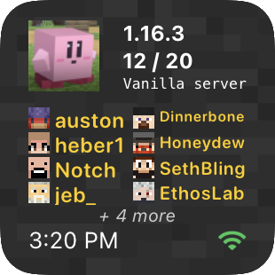

# MinecraftServerWidget.js

## Installation

Copy `MinecraftServerWidget/` folder and `MinecraftServerWidget.js` to your iCloud Drive under the 'Scriptable' folder.

Add a small widget to your home screen and set the widget parameter text to the publicly accessible address of the Minecraft server:

```
mc.example.com:25565
```

## Previews



<br />


