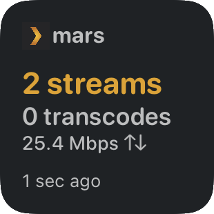

# PlexStreamsWidget.js



## Installation

Copy `PlexStreamsWidget/` folder and `PlexStreamsWidget.js` to your iCloud Drive under the 'Scriptable' folder.

Add a small widget to your home screen and set the widget parameter text to a JSON string with your own values:

```json
{"PLEX_HOST": "192.168.1.2:32400", "PLEX_TOKEN": "laksdhjalskd"}
```